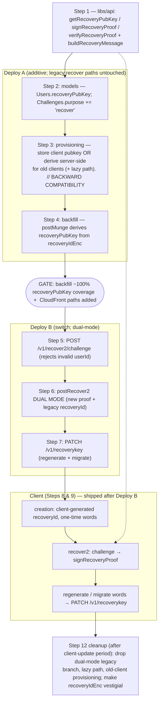

# Quick Crypt — Phase 2 Detailed Plan: Recovery by Challenge-Signed Proof

> Refined execution plan for Phase 2 of the master plan (`vibes/prf-implementation-plan.md`),
> mirroring `vibes/prf-phase1-plan.md`. **Deliverable: commit this content to `vibes/prf-phase2-plan.md`.**
> Reuses the Phase 1 generic ML-DSA-65 proof primitive (`libs/crypto/src/lib/proof.ts`) unchanged —
> only a new domain/context is added.

## Context — why we are doing this

Account recovery today rests on a **server-stored, replayable secret**. Recovery words are BIP39
24-word encodings of `recoveryId(16 random) ‖ userId(16)`. The server generates `recoveryId`
(KMS `GenerateRandom`) and stores it KMS-encrypted as `Users.recoveryIdEnc` (lazy at
`server.ts:438-466`, at creation `:642-698`). `POST /v1/recover2` decrypts `recoveryIdEnc` and
`knownLenTimingSafeEqual`s it against the submitted value (`server.ts:1540-1551`). **Anyone who can
read the DB and use KMS — including the server — can recover any account.**

Phase 2 removes that replayable secret. Recovery-word entropy stays the same 32 bytes, but the server
stores only a **recovery public key** (ML-DSA-65, derived from those 32 bytes via the Phase 1
primitive). To recover, the client signs a **single-use server-issued challenge** and the server
verifies the signature against the stored `recoveryPubKey`. Because the seed is a pure function of the
existing entropy, **every existing user's recovery words keep working** once a backfill derives each
user's `recoveryPubKey` from their existing `recoveryIdEnc`.

Phase 1 is already shipped and live in this codebase: `libs/crypto/src/lib/proof.ts`, the userCred
wrappers in `libs/api/src/index.ts:62-125`, server enforcement (`verifyProof`, `server.ts:1756-1798`,
gated at `:1840`), client signing (`authenticator.service.ts:322-344`), and the `postMunge`
`userCredPubKey` backfill (`internal.ts:414-475`). Phase 2 layers a second, recovery-scoped proof on
top, reusing all of it. (`PROOF_ENFORCE` is currently `false` / observe-only — `consts.ts:48`.)

**Two legacy recovery generations exist and must both keep working through the transition:**
- **`postRecover` (oldest)** — recover via raw `userCred` (`server.ts:1433-1507`); only for accounts
  with **no** `recoveryIdEnc`. The credentials panel already nudges these users to migrate
  (`credentials.component.html:47-65`, shown when `!hasRecoveryId()`).
- **`postRecover2` (current)** — recover via recovery words / `recoveryId` compared to `recoveryIdEnc`
  (`server.ts:1512-1588`); for accounts **with** `recoveryIdEnc`.

**Locked decisions (design discussion, 2026-06-13), with revisions:**
- **New accounts: client-generated recovery secret, server never sees it, no extra round-trip.** The
  reg/verify response already carries the userId (`authenticator.service.ts:1162`, `actualB64UserId`).
  The client generates the 16-byte `recoveryId`, forms `entropy = recoveryId ‖ userId`, derives
  `recoveryPubKey`, and adds **only the public key** to the existing reg/verify body. (`userCred`
  stays server-generated — client-side `userCred` is Phase 3.)
- **`recover2` runs in DUAL MODE during the client-update window** (revised): it accepts both the new
  `{userId, challenge, signature}` proof and the legacy `{userId, recoveryId}` comparison, with a
  `// BACKWARD COMPATIBILITY` comment marking the legacy branch for later removal.
- **`postRecover` (userCred recovery) stays in place.** Old-recovery accounts migrate to the
  recovery-words/`recover2` system via the existing credentials-panel button.
- **Re-display → regenerate.** Words are shown **once** at creation; a **regenerate** flow replaces
  re-display for everyone and doubles as the old→new migration path.
- **`recoveryIdEnc` cleanup is deferred to after the client-update period** (revised): it stays
  referenced in code (model + dual-mode legacy branch + lazy path + old-client provisioning) until all
  clients are updated, then is made vestigial in a final cleanup step. Its DynamoDB **data** is
  retained even longer as a manual-recovery net.
- **Backfill-before-switch is a hard invariant.** Recovery is account takeover; no grace for missing
  `recoveryPubKey`. The `postMunge` backfill (not lazy calls) brings every `recoveryIdEnc` account to
  ~100% `recoveryPubKey` coverage before recover2's new path is relied upon.

## Refinements made to the draft (verified against code)

- **R-A — Challenge endpoint does no user lookup, so no jitter is needed.** The draft proposed
  mirroring `postAuthOptions`'s not-found jitter (`server.ts:825-832`), which exists to mask a DB
  get + GSI query. The recovery challenge endpoint does **no user lookup at all** — no
  existence-dependent work means no timing side-channel to mask. It **does** reject a malformed userId
  (see R-B); all existence/auth checks stay behind recover2.
- **R-B — Challenge endpoint rejects an invalid userId** (per feedback): `base64UrlDecode(userId)`
  must succeed and decode to exactly `USERID_BYTES` (16). Otherwise `ParamError` (400). Format/length
  validation leaks nothing about account existence, so 400 here is fine (see R5).
- **R-C — Change-words endpoint is `PATCH /v1/recoverykey` (cookie identity, no `:userId` in path).**
  The user is already identified by cookie in `verifyCookie`. Less surface; the signed proof path
  (`url.pathname`) is trivially stable.
- **R-D — Concrete challenge generation:** `base64UrlEncode(randomBytes(32))` reusing `randomBytes`
  already imported (`server.ts:73`). No SimpleWebAuthn ceremony (the challenge is an opaque nonce).
- **R-E — Client randomness:** `crypto.getRandomValues(new Uint8Array(RECOVERID_BYTES))` for the new
  `recoveryId` (creation + regenerate/migration); `RECOVERID_BYTES` at `authenticator.service.ts:68`.
- **R-F — New CloudFront paths.** `/v1/recover2/challenge` and `/v1/recoverykey` must be added to the
  CloudFront/API-Gateway allowlist or they 403. Infra, not code — flag in the rollout.
- **R-G — Change-words protection.** Don't set `checkCsrf:false`: cookie+CSRF protect it today and
  the userCred proof additionally once `PROOF_ENFORCE=true`.

## The recovery proof contract (both runtimes must agree byte-for-byte)

**Seed (32-byte secret):** raw BIP39 entropy `recoveryId(16) ‖ userId(16)`, in that order.
- Client (recover2): `mnemonicToEntropy(words, wordlist)` output **verbatim** — do *not* round-trip
  through the base64 strings of `getRecoveryValues` (`authenticator.service.ts:1024-1049`).
- Server (backfill / legacy provisioning only):
  `concat(decryptField(recoveryIdEnc,{userId},RECOVERYID_BYTES), base64UrlDecode(userId))` —
  `recoveryId` first, `userId` second. **A flipped order fails every signature silently (R1).**
- The 32-byte length is exactly `RECOVERYID_BYTES(16)+USERID_BYTES(16)` = `crypto_kdf_KEYBYTES`, the
  KDF minimum enforced at `proof.ts:6`. Half the seed (userId) is public; the 128-bit random half
  makes the keypair unforgeable.

**Canonical message** (UTF-8, `\n`-joined; mirrors `buildUserCredMessage` at `index.ts:66-82`):
```
qcrypt-recovery-v1        # RECOVERY_SCHEME
<userId>                  # base64url, as exchanged
<challenge>               # server-issued, base64url, verbatim
```
- **No timestamp / skew window.** The challenge is single-use (consumed via
  `Challenges.delete(...).go({response:'all_old'})`) with a 5-min TTL — that *is* anti-replay.
  recover2 is `authorize:false`, so the `userId` field is load-bearing (no cookie identity).
- **Key-derivation context** `RECOVERY_KEY_CONTEXT = 'RecovKey'` (exactly 8 bytes, `proof.ts:9`, R8);
  **signature context** `RECOVERY_SIG_CONTEXT = 'qcrypt/recovery/proof/v1'`. Domain-separated from the
  userCred proof (`UCredKey` / `qcrypt/usercred/proof/v1`).

**New `libs/api` wrappers** (mirror the userCred trio at `index.ts:84-125`):
`getRecoveryPubKey(entropy32)`, `signRecoveryProof(entropy32, userId, challenge)`,
`verifyRecoveryProof(pubKey, userId, challenge, signature)` + private `buildRecoveryMessage`.
Zero `secKey` in `finally`.

## Shape of the change



## Work breakdown (ordered; rollout gate after Step 4)

### Step 1 — Recovery proof wrappers (`libs/api/src/index.ts`)
Add `RECOVERY_SCHEME` / `RECOVERY_KEY_CONTEXT` / `RECOVERY_SIG_CONTEXT`, `buildRecoveryMessage`, and
the three wrappers, copying the userCred pattern verbatim (drop method/path/ts/bodyHash; substitute
`challenge`). New `libs/api` recovery spec: exact-bytes message stability; a fixed `entropy → pubKey`
**parity vector** (R1 guard); round-trip; tamper; `RECOVERY_KEY_CONTEXT.length === 8` (R8); domain
separation vs userCred.

### Step 2 — Data model (`apps/server/src/models.ts`)
- Add `recoveryPubKey: {type:"string", required:false}` to `Users` (next to `userCredPubKey:64-67`).
- Add `"recover"` to `Challenges.purpose` enum (`:281`).
- (`recoveryIdEnc` stays in `Users` attrs `:60-63` and `VerifiedUserItem` `:413` — removed only in
  the Step 12 cleanup, after the client-update period.)

### Step 3 — New-account & legacy provisioning (`apps/server/src/server.ts`)
Dual handling, with an explicit `// BACKWARD COMPATIBILITY (remove after client-update period)`
comment on every old-client branch:
- **New-user block (`:620-701`):** if reg/verify body carries `recoveryPubKey` → store it; do **not**
  store `recoveryIdEnc` (the unused KMS `recoveryId` slice from `randData` is harmless — leave sizing
  as-is). **// BACKWARD COMPATIBILITY:** else (old client) keep generating `recoveryId` +
  `recoveryIdEnc` and returning `recoveryId`, **and additionally** set
  `recoveryPubKey = base64UrlEncode(getRecoveryPubKey(concat(recoveryId, base64UrlDecode(userId))))`.
- **Lazy path (`:438-466`):** **// BACKWARD COMPATIBILITY:** when it generates `recoveryIdEnc` for an
  old client, also derive + store `recoveryPubKey`. (Still needed so old clients hitting
  `includeRecovery` get a pubkey; removed in Step 12.)
- **`hasRecoveryId` (`makeUserInfoResponse:1075`):** switch to
  `!!recoveryPubKey || !!recoveryIdEnc` for the transition (defensive OR avoids a false "old recovery"
  prompt for backfill-pending accounts); simplify to `!!recoveryPubKey` in Step 12.
- *Cannot drop any `recoveryIdEnc` reference here* — old clients and the legacy recover paths still
  need it until Step 12.

### Step 4 — Backfill (replace `postMunge` body, `internal.ts:414-475`) — Deploy A, run before Deploy B
Replace the `postMunge` body with the recovery backfill (keep the `testkey`-gated endpoint + batching
scaffold). Scan attrs `["userId","verified","recoveryIdEnc","recoveryPubKey"]`; skip the
`AAAAAAAAAAAAAAAAAAAAAA` sentinel, unverified users, users with no `recoveryIdEnc`, and users that
already have `recoveryPubKey`; then `decryptField(recoveryIdEnc,{userId},RECOVERYID_BYTES)` →
`getRecoveryPubKey(concat(decrypted, base64UrlDecode(userId)))` → `patch.set({recoveryPubKey})`.
Idempotent; report `total/updated`. **Never deletes `recoveryIdEnc`.** This `postMunge` backfill — not
lazy calls — is the migration mechanism for all `recoveryIdEnc` accounts.

### Step 5 — Recovery-challenge endpoint (`server.ts` + `urls.ts`) — Deploy B
- `urls.ts`: add `Patterns.recoverChallenge = new URLPattern({pathname:'/v:ver/recover2/challenge'})`
  near `recover2:92`; register `postRecoverChallenge` in `METHODMAP.POST` (`authorize:false`) before
  `postRecover2` (`:1899`).
- `postRecoverChallenge`: **reject an invalid userId** (R-B) — `base64UrlDecode(body.userId)` must
  decode to `USERID_BYTES` (16) bytes, else `ParamError` (400). Then
  `challenge = base64UrlEncode(randomBytes(32))`,
  `Challenges.create({challenge, purpose:'recover', userId: body.userId}).go()`, return `{challenge}`.
  **No user lookup, no jitter** (R-A).

### Step 6 — `postRecover2` dual mode (`server.ts:1512-1588`) — Deploy B
Branch on the body shape; keep both paths until Step 12:
- **New path** (`body.signature` present): consume the challenge via
  `Challenges.delete({challenge}).go({response:'all_old'})`; validate present, `expiresAt`,
  `purpose==='recover'`, `userId===body.userId` (copy `:518-535`). Load user; require `recoveryPubKey`
  (else `AuthError()`); `verifyRecoveryProof(base64UrlDecode(recoveryPubKey), userId, challenge,
  base64UrlDecode(signature))` in try/catch → `AuthError()` on failure.
- **`// BACKWARD COMPATIBILITY (remove after client-update period)` legacy path** (`body.recoveryId`
  present): the current `recoveryIdEnc` decrypt + `knownLenTimingSafeEqual` comparison, unchanged
  (`:1524-1551`).
- Both paths converge on the **unchanged tail** (`:1553-1587`): wipe Authenticators, bump `recovered`,
  clear `lastCredentialId`, `registrationOptions(...,'reg')`.
- Param validation may stay 400 `ParamError` (R5 — no uniform-failure requirement).

### Step 7 — Change-words / migration endpoint (`server.ts` + `urls.ts`) — Deploy B
`Patterns.recoverykey = new URLPattern({pathname:'/v:ver/recoverykey'})`; register `patchRecoveryKey`
in `METHODMAP.PATCH` (`authorize:true`, **do not** set `checkCsrf:false`, R-G). Handler: validate
`validB64(body.recoveryPubKey)`, `Users.patch({userId: verifiedUser.userId}).set({recoveryPubKey})`,
`recordEvent`, return `makeUserInfoResponse`. Serves both **regenerate** and the **old→new migration**
(old-recovery accounts upload a freshly generated pubkey here). The server never sees the secret.

### Step 8 — Web client (`authenticator.service.ts`)
- **Creation (`newUser:1083` → `_doPasskeyVerify:1152-1205`):** for the new-user case
  (`includeRecovery`), read `actualB64UserId` (`:1162`), generate a 16-byte `recoveryId` (R-E),
  `entropy = concat(recoveryId, base64ToBytes(actualB64UserId))`, derive `recoveryPubKey`, add it to
  the `expanded` body (`:1178-1185`), cache the **words** for one-time display (replace
  `_cachedRecoveryId:1102`). `entropy.fill(0)` after deriving + encoding words.
- **`recover2:1051-1063`:** `entropy = mnemonicToEntropy(words, wordlist)`; `userId =
  bytesToBase64(entropy.slice(16,32))`; `POST recover2/challenge {userId}` → `{challenge}`;
  `signRecoveryProof(entropy, userId, challenge)`; `POST recover2 {userId, challenge, signature:
  bufferToBase64URLString(sig.buffer)}`; `entropy.fill(0)` in `finally`. Keep the `_finishRegistration`
  tail. Fresh challenge per attempt (R7).
- **`getRecoveryWords:443-475`:** one-time display of the cached words (remove the
  `_createSessionImpl(true,true,...)` server re-fetch branch).
- **Add `changeRecoveryWords()`:** new 16-byte `recoveryId` (R-E), `entropy = concat(recoveryId,
  base64ToBytes(this.userId))`, `words = entropyToMnemonic(entropy, wordlist)`, derive `recoveryPubKey`,
  upload via `_doFetch` `PATCH resource:'recoverykey'` body `{recoveryPubKey}`, cache words; `entropy
  .fill(0)`. This is **both** regenerate and the old→new migration upload.

### Step 9 — UI (`apps/web/src/app/showrecovery/`, `recovery2/`, `credentials/`)
- `showrecovery`: one-time display after creation; a **Regenerate** action calling
  `changeRecoveryWords()`; for old-recovery accounts (no cached words, `!hasRecoveryId()`) the page
  generates + uploads via `changeRecoveryWords()` — completing the migration the credentials panel
  prompts for. Reuse the `refreshUserInfo` pattern (`showrecovery.component.ts:122-125`).
- `recovery2`: unchanged UX, now driving the challenge-signed `recover2`. Reuse the existing
  FormControl + `getRecoveryValues` validation.
- `credentials`: the existing `!hasRecoveryId()` migration prompt (`credentials.component.html:47-65`)
  stays — it now drives the client-side migration above.

### Step 10 — Tests
- **Unit** (new `libs/api` recovery spec): parity vector, message stability, round-trip, tamper,
  8-byte context, domain separation vs userCred.
- **Server** (`apps/server/spec`, `nid-webauthn-emulator`): recover2 new path accepts a valid
  challenge-signed proof; rejects wrong signature / replayed (consumed) challenge / expired / wrong
  `purpose` / wrong `userId` / missing `recoveryPubKey`; **legacy `recoveryId` path still works**
  (dual mode); challenge endpoint rejects malformed userId and succeeds uniformly for unknown users;
  backfill derives the same pubkey a client signs against and is idempotent; new-account provisioning
  stores a client-supplied pubkey; `/recoverykey` overwrites the pubkey and is proof/CSRF-gated.
- **E2E** (`apps/web/tests`, alongside `lifecycle.spec.ts`): create → words shown once → recover in a
  fresh context succeeds; regenerate → old words fail, new words succeed; tampered/missing signature →
  failure. Honor the user-tracking contract. (No `@nukeall` — that tag no longer exists in the suite.)

### Step 11 — Rollout (user-managed; ordering is the safety property)
1. **Deploy A:** `recoveryPubKey` attribute (Step 2) + dual provisioning incl. lazy path (Step 3) +
   backfill (Step 4). Legacy `postRecover` / `postRecover2` / re-display **unchanged**.
2. **Run the `postMunge` backfill** until a second run reports ~0 newly added.
3. **Add CloudFront/API-Gateway allowlist** for `/v1/recover2/challenge` and `/v1/recoverykey` (R-F).
4. **Deploy B:** challenge endpoint (Step 5) + recover2 **dual mode** (Step 6) + `/recoverykey`
   (Step 7). Legacy `recoveryIdEnc` reads remain.
5. **Ship the new client** (Steps 8/9) and open the client-update window.

### Step 12 — Post-client-update cleanup (after the update window; not part of Deploy B)
Once telemetry shows legacy recover2/provisioning paths are no longer used: drop the dual-mode legacy
`recoveryId` branch (Step 6), the lazy path (`server.ts:438-466`), the old-client provisioning branch
and `recovery=true` re-display plumbing (`makeLoginUserInfoResponse:1037-1049`), simplify
`hasRecoveryId` to `!!recoveryPubKey`, remove `recoveryIdEnc` from the model
(`models.ts:60-63,413`), and revert `postMunge` to inert. **DynamoDB `recoveryIdEnc` data is retained
even past this step** as a manual-recovery net; its deletion is a separate, later operator task (R6).

## Critical files
- `libs/api/src/index.ts` — recovery proof wrappers + `buildRecoveryMessage` (Step 1).
- `apps/server/src/models.ts` — `Users.recoveryPubKey`; `Challenges.purpose += 'recover'`; later drop
  `recoveryIdEnc` (Steps 2, 12).
- `apps/server/src/server.ts` — provisioning (`_doPostRegVerify`, lazy path), `postRecoverChallenge`,
  `postRecover2` dual mode, `patchRecoveryKey`, `hasRecoveryId` source, `METHODMAP` (Steps 3,5-7,12).
- `apps/server/src/urls.ts` — `recover2/challenge` + `recoverykey` patterns/routes (Steps 5, 7).
- `apps/server/src/internal.ts` — `recoveryPubKey` backfill replacing `postMunge` (Step 4).
- `apps/web/src/app/services/authenticator.service.ts` — client-generated creation, challenge-signed
  `recover2`, one-time words, `changeRecoveryWords` (Step 8).
- `apps/web/src/app/{showrecovery,recovery2,credentials}/` — regenerate + migration UI (Step 9).
- `libs/crypto/src/lib/proof.ts` — unchanged; both sides depend on it.

## Residual risks / explicit decisions
- **R1 — Seed byte-order parity** (`recoveryId ‖ userId`; client raw `mnemonicToEntropy`, server
  `decrypt(recoveryIdEnc) ‖ base64UrlDecode(userId)`). A flip fails every recovery with a silent 401.
  Guard with the `libs/api` parity vector + a server backfill-vs-client-signature spec.
- **R2 — Account enumeration** via the challenge endpoint: structurally mitigated — no user lookup
  (R-A); only userId *format* is validated (R-B). All existence/auth checks live behind recover2.
- **R3 — Rollout ordering.** Backfill to ~100% before relying on recover2's new path. The cleanup
  (Step 12) must wait for the client-update window or it breaks stale clients.
- **R4 — Legacy accounts without `recoveryIdEnc`.** `postRecover` (userCred recovery) **stays in
  place**; these accounts migrate to recover2 via the credentials-panel button
  (`credentials.component.html:47-65`) → `/showrecovery` → `changeRecoveryWords()` uploads a
  `recoveryPubKey`. The backfill correctly skips them (no `recoveryIdEnc`).
- **R5 — recover2/challenge param validation.** Uniform failure for *invalid input* is **not**
  required; malformed params return 400 `ParamError`. (Existence/auth failures still return uniform
  `AuthError()`.)
- **R6 — `recoveryIdEnc` cleanup is staged.** Code references removed only in Step 12 (after the
  client-update period); DynamoDB data retained even longer as a manual-recovery net.
- **R7 — Single-use challenge.** Client fetches a fresh recovery challenge per attempt (aborted
  WebAuthn registration after passkey-wipe unchanged, `server.ts:1557-1560`).
- **R8 — `RecovKey` must be exactly 8 bytes** (`proof.ts:9`); assert in a unit test.
- **R9 — `postMunge` is THE backfill** (not lazy migration). The only constraint: confirm Phase 1's
  `userCredPubKey` backfill (the current `postMunge` occupant) has finished running in production
  before reusing the single `postMunge` endpoint for the recovery backfill — otherwise that prior
  backfill code is lost mid-run.

## Verification (end-to-end)
- **Unit:** full `pnpm test` after the `libs/api` change (crypto + server + web + cli).
- **Server:** `pnpm test:server` (against `test.quickcrypt.org`) — incl. dual-mode recover2.
- **E2E:** `nohup pnpm serve &` then `pnpm test:e2e --reporter=list` — create → one-time words →
  recover in a fresh context; regenerate revokes old words; tampered/missing signature rejected.
- **Build:** `pnpm build:web` / `build:server`; no new WASM (primitive unchanged), so strict-CSP is
  unaffected — confirm via `deploy:web validate`.
