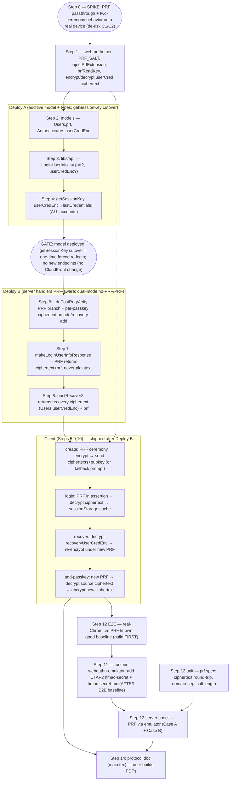

# Quick Crypt — Phase 3 Plan: Client-Side userCred Encrypted Under a WebAuthn PRF

> Detailed execution plan for **Phase 3** of the master plan (`vibes/prf-implementation-plan.md`, Phase 3 at ~`:118`), mirroring `vibes/prf-phase2-plan.md`.
> Reuses the Phase 1/2 ML-DSA-65 proof primitive (`libs/crypto/src/lib/proof.ts`) and the proven `MasterKeyKeyProvider` + `cipherSvc.encryptStream/decryptStream` ciphertext pattern unchanged.

## Current status (2026-07-08)

**Server (Quick Crypt, branch `prf-phase3`) — code-complete.** Steps 2, 3, 4, 6, 7, 8 done (see per-step `DONE` markers). Challenge-purpose refactor landed: `'recover'` for recovery WebAuthn reg challenges, `'nonce'` for the ML-DSA proof nonce. The recovery-add / normal-add ciphertext storage + all-or-nothing guards remain DEFERRED to the client flows (Step 10). Server specs run against the **deployed** server, so `prf-phase3` must be deployed to test before Step 12 specs validate.

**NID emulator (peer clone `../nid-webauthn-emulator`, branch `feat/hmac-secret`) — Step 11 DONE, ready for server testing.** Real CTAP2 `hmac-secret` + `hmac-secret-mc`, selectable via `new AuthenticatorEmulator({ hmacSecret })`; `getInfo` advertising; per-credential `CredRandom` generated at makeCredential and persisted (repository JSON + stateless credentialId blob); `HMAC-SHA-256(CredRandom, salt)` at getAssertion inside the signed authData. The WebAuthn bridge maps `prf` ⇄ `hmac-secret` with the `SHA-256("WebAuthn PRF"‖0x00‖input)` salt derivation, and `createJSON`/`getJSON` decode/encode base64url `prf` **both directions**. 143 tests green; English docs updated; JA docs + upstream PR deferred until after the server specs (which double as emulator validation).

**Next (fresh session):** Step 12 **server API specs** (`apps/server/spec`) driving real PRF through the emulator — one pass exercises both Quick Crypt's server and the NID emulator. Then client Steps 5/9/10 + fallback UI. Emulator consumption is **not wired yet**: point `package.json` at the fork branch/commit and extend `apps/server/spec/common.ts` `getWebAuthnEmulator` to pass `hmacSecret` + PRF helpers (see Step 11 "Consumption in this repo").

## Context — why we are doing this

Today every account is **no-PRF**: `userCred` (32 bytes) is generated **server-side** at first registration (KMS `GenerateRandom`, `server.ts:630-636`), stored KMS-encrypted as `Users.userCredEnc` (+ `userCredEncOld` backup, `:651-660`), and **returned in plaintext** at login (`makeLoginUserInfoResponse:1072-1076`). Because the server holds `userCred`, it can reconstruct the hint key and per-block MAC key (master plan `:11-17`).

Phase 3 makes **new accounts PRF**: the client generates `userCred`, obtains a 32-byte secret from a WebAuthn **PRF extension** output, encrypts `userCred` under it, and stores only **opaque ciphertexts** server-side. For PRF accounts the server **never learns plaintext `userCred`**. Two server-undecryptable storage locations hold the secret:

- **`Authenticators.userCredEnc`** — one ciphertext per passkey, encrypted under that passkey's PRF output.
- **`Users.userCredEnc`** (the existing field, reused) — for PRF this holds `userCred` encrypted under the 32-byte recovery secret (`recoveryId(16) ‖ userId(16)`), so recovery words can still resurrect `userCred` onto a fresh passkey. (No-PRF the same field holds the KMS copy.) There is **no** separate `recoveryUserCredEnc` column.

The existing **client sessionStorage-at-rest** encryption (`_loginUser:549-572`, keystore-derived key via `MasterKeyKeyProvider(derivedKey, userId)`) is **distinct** from these server-side ciphertexts and **stays unchanged** — it is the local cache; the new PRF ciphertext is the server-side root. **Per-request proof is unaffected:** `_doFetch:330-353` signs with the plaintext `userCred` it decrypts from the sessionStorage cache, so PRF is needed **only at the initial passkey assertion** (create/login/recover/add) to populate that cache, never per request and never on tab-restore.

### Locked product decisions (confirmed with owner)

1. **Full lifecycle in scope:** create + login + recover + add-passkey, all PRF-aware for PRF accounts.
2. **Fallback:** if the registering passkey lacks PRF, **prompt** the user to switch passkeys or continue on the existing no-PRF path. No silent downgrade.
3. **PRF salt:** a single **fixed global app constant** (not per-account).
4. **getSessionKey:** switch key material from `Users.userCredEnc` → `lastCredentialId` **uniformly for all accounts**, accepting a one-time forced re-login at deploy.
5. **Server-side test fidelity:** add real **PRF / CTAP2 `hmac-secret` and `hmac-secret-mc`** support to `nid-webauthn-emulator` (fork + upstream PR), caller-selectable per session, so server specs drive genuine PRF ceremonies — `hmac-secret-mc` for Case A (results at create), `hmac-secret` for Case B (assert-only) — not hand-built ciphertexts.
6. **Build the two-ceremony path (Case B) — empirically required.** The research matrix said "reliable at create"; the first Step 0 device runs (2026-06-28) disproved it: 1Password gives PRF at `create()` (Case A) but Chrome's native authenticator and YubiKey give it only at assertion (Case B), because PRF rides CTAP2 `hmac-secret` which is assertion-only by spec. So creation runs the PRF ceremony as: use `create()` results if present (Case A optimization), else do a follow-up `get()` (Case B), else — genuinely no PRF — fall back (decision 2). We still **track which case occurred** on the final creation ceremony (Step 5b) for ongoing field telemetry.

### Phase 1/2 foundation this builds on (verified)

- `libs/api/src/index.ts:23-35` exports `getUserCredPubKey`/`signUserCredProof` + `getRecoveryPubKey`/`signRecoveryProof`/`recoverySecret`; `proof.ts` derives ML-DSA-65 keypairs via `crypto_kdf_derive_from_key(32,1,context,secret)`, domain-separated by 8-byte context (`UCredKey`/`RecovKey`).
- Recovery is **already client-generated** (Phase 2): `newUser` → `_newRecovery(optionsJson.user.id)` (`authenticator.service.ts:473-485,1148`) sends only `recoveryPubKey` in the reg/verify body; `recover2` (`:1082-1114`) signs a challenge. Server stores `recoveryPubKey` (`models.ts:68-71`); `Challenges.purpose` includes `'recover'`.
- `MasterKeyKeyProvider` requires `masterKey.byteLength === 32` and rejects all-zero — PRF output (32) and recovery secret (32) both fit.

## Corrections / hazards (verified against installed code)

- **C1 — @simplewebauthn does NOT transform PRF extension I/O (load-bearing, verified).** In `@simplewebauthn/browser` v13.3.0, `startRegistration` spreads `...optionsJSON` and converts **only** `challenge`, `user.id`, `excludeCredentials` (`esm/methods/startRegistration.js:26-34`); `startAuthentication` is analogous. `extensions` passes through **verbatim** to the native `create()`/`get()`, and `clientExtensionResults` is the **native** `getClientExtensionResults()` (`startRegistration.js:114`, `startAuthentication.js:92`). Therefore `extensions.prf.eval.first` must be a real **`BufferSource`**, NOT a base64url string, and `clientExtensionResults.prf.results.first` is an **`ArrayBuffer`**, read directly. A naive base64 string silently no-ops PRF. Drives the Step 0 spike + the `injectPrfExtension`/`prfReadKey` helpers.
- **C2 — two-ceremony registration (REQUIRED, decision 6 — confirmed empirically).** When a platform reports `prf.enabled === true` at `create()` but returns no `prf.results`, reading PRF needs a follow-up `get()` (a second ceremony). The Step 0 device runs show this is **common, not rare** — Chrome's native authenticator and YubiKey are both Case B (only 1Password returned results at create). Root cause: PRF is the CTAP2 `hmac-secret` extension, which emits output **only at `getAssertion`**, never `makeCredential`; create-time PRF exists only where a provider synthesizes it. So creation must handle: **Case A** (results at create → use them, skip the `get()`), **Case B** (no results → follow-up `get()` on the just-created credential, same salt → same output), **no-PRF** (decision-2 fallback). The follow-up `get()` costs **+1 user gesture at signup/add-passkey only**; login is always single-gesture. Output is read-time-independent (`create-vs-assert: equal`), so mixing A/B accounts is safe.
- **C3 — `nid-webauthn-emulator@0.2.14` has no PRF/hmac-secret support → we add it (fork + upstream).** Server specs (`apps/server/spec`) drive real WebAuthn ceremonies through the emulator against the deployed server, so genuine PRF support gives true end-to-end coverage of the PRF flows. The package ships only compiled `dist` (source on GitHub, MIT). We fork, implement `hmac-secret` in TypeScript, open an upstream PR, and consume via a pinned fork commit (Step 11). A minimal dummy-ciphertext seam is retained only as a fallback for branches that don't need a live ceremony. **E2E (Playwright)** PRF is separate — it depends on whether the pinned Chromium `WebAuthn.addVirtualAuthenticator` exposes a PRF option (VERIFY in Step 12); otherwise gate e2e behind a client seam + real-device checklist.
- **C4 — reusing the recovery secret as both ML-DSA seed and cipher master key is safe.** It feeds (a) `getProofKeyPair(secret,'RecovKey')` (libsodium `crypto_kdf`, `RecovKey` context) and (b) `MasterKeyKeyProvider(secret, userId)` (its own per-cipher BLAKE2b/KDF, `Cphr_Key` context). Different KDFs/contexts, and neither uses the bare secret as an output key → no cross-protocol collision. Same for the PRF output (used only as a cipher master key, never an ML-DSA seed). Central crypto-safety claim.
- **C5 — the global PRF salt must be stable forever.** PRF output = `HMAC(credential_prf_key, salt)`; changing the salt orphans every per-passkey ciphertext. Salt is a **public, fixed** app constant. Never per-account, never rotated.
- **C6 — `getSessionKey` cutover forces a one-time re-login for ALL accounts.** Switching the HKDF input from `userCredEnc` to `lastCredentialId` changes every `jwt_key`/`csrf`, invalidating all live cookies at Deploy A. Accepted, no dual-mode (master plan `:42`). `verifyCookie` already reads `lastCredentialId` (`:1934`) and it is on every row → no backfill.
- **C7 — emulator assertion signature must cover the returned authData (fork hazard).** `WebAuthnEmulator.get()` unpacks the CTAP authData then **re-packs** it for the response (`webauthn-emulator.ts:279`→`:288`); the assertion signature is computed over the signed authData, so if the re-pack drops the hmac-secret extension bytes the server's assertion verification fails. Fix: return the **raw signed `authData`** from the CTAP response and unpack only to read the PRF output for `getClientExtensionResults`. (Registration uses `fmt:"none"` — no signature — but keep the attestation authData faithful too.)

## PRF support matrix (2026 research) + Step 0 empirical results

**Source:** owner's research spreadsheet (non-empirical / AI-assisted survey, ~mid-2026):
`https://docs.google.com/spreadsheets/d/1vpLU5f-hsmOfWfNwl4gP1OpNr5VZCcvB8MB5kz_ylMs` (gid 1376596615).
76 rows across authenticator type × platform × browser.

**The rule that decides decision 6:** _every system that supports PRF supports it reliably at
`create()`_ — with a single class of exception: **external hardware keys (YubiKey, SoloKeys) on
iOS/iPadOS** report PRF support but return no result at creation (**WebKit bug 311099**; fix
reportedly landed in Safari Technology Preview 241 / WebKit 21625.1.12). Every other "no" is a
_no-PRF-at-all_ system, not a two-ceremony system.

| Category                                                | PRF reliable at `create()`                                                                             | No PRF at all                                                              |
| ------------------------------------------------------- | ------------------------------------------------------------------------------------------------------ | -------------------------------------------------------------------------- |
| Platform                                                | Apple Secure Enclave (macOS + iOS, all browsers); Windows Hello (Win11 26200+, Edge/Chrome/Firefox)    | Linux platform/TPM (no OS authenticator)                                   |
| Browser sync                                            | Google Passkey sync (Chrome); iCloud Keychain (macOS Safari/Chrome/Edge, Windows Chrome/Edge, iOS all) | iCloud Keychain on **macOS Firefox**; Microsoft Account sync; Firefox Sync |
| Password managers                                       | 1Password, Dashlane, Keeper (ext v17.8.0+), ProtonPass                                                 | Bitwarden (PRF only unlocks its _own_ vault), LastPass, NordPass           |
| Hardware keys                                           | YubiKey & SoloKeys on **macOS / Windows / Linux** (all browsers)                                       | —                                                                          |
| **PRF but NOT at create (the only two-ceremony cases)** | —                                                                                                      | YubiKey & SoloKeys on **iOS/iPadOS** (WebKit bug 311099)                   |

**⚠️ EMPIRICAL OVERRIDE (Step 0 runs, 2026-06-28): the matrix's "reliable at create" is WRONG.** First
real device runs on a MacBook Pro M1 show a **mixed** reality: **1Password returns PRF at `create()`
(Case A)**, but **Chrome's native/GPM authenticator and YubiKey return it only at assertion (Case B)**
— observed across Chrome 149 and Safari 26.5. Root cause: PRF rides the CTAP2 **`hmac-secret`**
extension, which by spec emits output **only during `getAssertion`**, never `makeCredential`;
"PRF at create" exists only where the credential _provider_ internally synthesizes a
create-then-assert (1Password does; Chrome's native authenticator does not — and may or may not in
future). **Therefore decision 6 is FLIPPED → we BUILD the two-ceremony path** (a follow-up `get()` to
read PRF at registration), with Case A as a gesture-saving optimization (skip the `get()` when
`create()` already returned results). The field is mixed, so both must be handled. Output is identical
whether read at create or assert (`create-vs-assert: equal=true` on 1Password), so mixing modes is
correctness-safe.

### Step 0 empirical results (spike at `/assets/prf-spike/spike.html`)

A = result at `create()`; B = result at assertion; C = stable across assertions; D = differs per
credential. Any **C=NO** or **D=NO** is a hard blocker. **A=NO, B=YES = Case B** (needs the follow-up
`get()`). The headline: **the field is mixed**, so the two-ceremony path is required (decision 6
flipped). A spike-output quirk: an early batch was invalidated by a terminal paste bug that duplicated
one capture; only distinct-hash runs are trusted below.

| Platform / authenticator                 | Browser     | A (create)         | B (assert) | C (stable) | D (unique) | Notes                                                                                        |
| ---------------------------------------- | ----------- | ------------------ | ---------- | ---------- | ---------- | -------------------------------------------------------------------------------------------- |
| macOS M1 / 1Password                     | Chrome 149  | **YES**            | YES        | YES        | YES        | Case A; create==assert. Confirmed run (distinct hashes 7d6b…/7f3e…).                         |
| macOS M1 / Chrome native (GPM)           | Chrome 149  | **NO**             | YES        | —          | —          | Case B — surprising but protocol-honest (hmac-secret assert-only). Reported; capture log.    |
| macOS M1 / YubiKey                       | Chrome 149  | **NO**             | YES        | YES        | YES        | Case B confirmed (≈ Safari+YubiKey).                                                         |
| macOS M1 / YubiKey                       | Safari 26.5 | **NO**             | YES        | YES        | YES        | Case B confirmed (distinct hash fc02…).                                                      |
| macOS M1 / Apple Passwords               | Chrome 149  | **YES**            | YES        | YES        | YES        | Case A; create==assert. Confirmed (distinct hashes fe36…/7ce8…).                             |
| macOS M1 / Apple Passwords               | Safari 26.5 | **YES**            | YES        | YES        | YES        | Case A; create==assert. Confirmed (distinct hashes e27e…/763b…).                             |
| iOS / 1Password                          | Chrome 149  | **YES**            | YES        | YES        | YES        | Case A; create==assert. Confirmed (3f35…/946c…).                                             |
| iOS / Apple Passwords (iCloud Keychain)  | Safari      | **YES**            | YES        | YES        | YES        | Case A; create==assert. Confirmed (8b11…/d894…).                                             |
| Windows Hello                            | Edge        | ?                  | ?          | ?          | ?          | pending                                                                                      |
| Android / Google Password Manager        | Chrome      | ?                  | ?          | ?          | ?          | pending                                                                                      |
| YubiKey on iOS/iPadOS                    | Safari      | ?                  | ?          | ?          | ?          | matrix predicts even assert is broken (bug 311099)                                           |
| **Chromium virtual authenticator (CDP)** | Playwright  | A _or_ B _or_ none | YES        | YES        | YES        | `hasPrf`→A, `hasHmacSecret`→B, neither→none; `hasHmacSecretMc` crashes. Verified 2026-06-29. |

## The PRF contract (client only — server stores opaque ciphertexts)

**PRF salt (fixed global constant):** `PRF_SALT: Uint8Array` = 32 fixed bytes (`SHA-256("qcrypt/prf/v1")`, hardcoded as a `const Uint8Array`). Lives in the web app, passed as `extensions.prf.eval.first` (BufferSource, C1).

**WebAuthn PRF ⇄ CTAP2 hmac-secret salt mapping (parity hazard, used by both the client/browser and the emulator):** the input `first` is mapped to the CTAP hmac-secret salt as `SHA-256(UTF8("WebAuthn PRF") ‖ 0x00 ‖ first)`. The browser does this for real authenticators; our emulator (Step 11) must do the identical mapping so its output matches a real device.

**Per-passkey ciphertext:** `userCredEnc = encryptStream(userCred32, MasterKeyKeyProvider(prfOutput32, userId), {algs:['X20-PLY']})` → base64. Identical construction to the sessionStorage cache (`_loginUser:554-564`), but the master key is the **PRF output** and the ciphertext is stored **server-side per passkey**.

**Recovery ciphertext:** `prfEncrypt(userCred32, recoverySecret32, userId)` → base64, with `recoverySecret = recoverySecret(recoveryId, userId)`. Sent on the wire as `recoveryUserCredEnc` and stored server-side in the existing `Users.userCredEnc` column (no new column). Self-describing cipher stream → no extra metadata stored.

**Account mode:** `Users.prf: boolean`. Server infers PRF at creation from the **presence of client `userCredEnc` + `userCredPubKey`**. Once set, the account is **all-or-nothing**: every add/recovery for a `prf:true` account MUST supply a ciphertext; the server rejects a non-PRF add to a PRF account and rejects a ciphertext on a `prf:false` account.

**userCredPubKey:** client-supplied at creation for PRF (`getUserCredPubKey(userCred)`), as `recoveryPubKey` is today. No-PRF still derives it server-side (`server.ts:662`).

## Shape of the change

## Work breakdown (ordered; rollout gate after Step 4)

### Step 0 — PRF spike (do first; gates the whole client flow)

Deployed as a static asset at `apps/web/src/assets/prf-spike/spike.{html,css,js}` →
`https://test.quickcrypt.org/assets/prf-spike/spike.html` (CSP-clean: external same-origin CSS/JS
with sha384 integrity; raw `navigator.credentials` API, which mirrors what `@simplewebauthn` calls).
On each device it: sets `extensions = { prf: { eval: { first: PRF_SALT } } }`, runs registration,
inspects `clientExtensionResults.prf` (results vs enabled-only), runs an assertion to read PRF,
repeats to check **stability**, and registers a second passkey to check **per-credential
uniqueness**. **Record results in the Step 0 table above.** This is the **empirical input** to
decision 6 — and it already disproved the matrix: macOS is mixed (Apple Passwords + 1Password = Case A;
Chrome-GPM + YubiKey = Case B), so the two-ceremony path **is** built. Remaining runs (Windows Hello,
Android, iOS) refine the field distribution but won't change that. Throwaway — `assets/**` ships to
prod, so delete `assets/prf-spike/` before any production deploy. No production code ships from this step.

### Step 1 — Web PRF helpers (`apps/web/src/app/services/prf.ts`) — DONE

Plain exported functions (not a service/class — no DI needed, only `authenticator.service` uses them):

- `PRF_SALT: Uint8Array` — hardcoded 32-byte `const` (`SHA-256("qcrypt/prf/v1")`); never change it.
- `injectPrfExtension(optionsJson): void` — sets `extensions.prf.eval.first = PRF_SALT` as a real BufferSource (C1), creating `extensions` if absent. (The Case-B follow-up `get()` builds its own `allowCredentials`; not this helper's job.)
- `prfReadKey(clientExtensionResults): Uint8Array<ArrayBuffer> | null` — narrows `prf.results.first` via `instanceof ArrayBuffer` (no cast) and throws if length ≠ `KEY_BYTES`; `prfEnabled(clientExtensionResults): boolean` (C2).
- `prfEncrypt(plainText, prfKey, userId): Promise<string>` / `prfDecrypt(cipherText, prfKey, userId): Promise<Uint8Array<ArrayBuffer>>` — generic (not userCred-specific): `MasterKeyKeyProvider(prfKey, userId)` + `encryptStream`/`decryptStream({algs:['X20-PLY']})` from `@qcrypt/crypto` directly (no `cipherSvc`, no `cryptoReady` — caller ensures crypto loaded). Each takes ownership of and wipes `prfKey`.
- Added a production `streamFromBytes(Uint8Array<ArrayBuffer>): ReadableStream` to `libs/crypto/src/lib/utils.ts` (exported from index; `streamFromBase64` now delegates to it). Used so `prfEncrypt` streams raw bytes without a base64 round-trip.

`prf.spec.ts` (11 tests, green): `PRF_SALT` length; `injectPrfExtension` set + preserve + auto-create; `prfReadKey` result/null/wrong-length-throws; `prfEnabled`; encrypt→decrypt round-trip; wrong-key decrypt fails; all-zero and wrong-length key rejected. **Verified:** full `pnpm test` green (crypto 124, api 11, cli 48, web 167). (C4 domain-separation deferred to the recovery-secret wiring, where both consumers actually meet.)

### Step 2 — Data model (`apps/server/src/models.ts`) — Deploy A — DONE

- `Users`: added `prf: {type:"boolean", required:false}` (after `recoveryPubKey`). No `recoveryUserCredEnc` column — the recovery ciphertext reuses the existing `Users.userCredEnc` field.
- `Authenticators`: added `userCredEnc: {type:"string", required:false}` (after `attestationObject`).
- All additive/optional → existing rows read as no-PRF (`!prf`); DynamoDB is schemaless so no table migration. `VerifiedUserItem`/`AuthItem` pick up the new attrs via `EntityRecord`/`EntityItem` (no augmentation needed). Verified: `pnpm build:server` + `tsc --noEmit -p apps/server/tsconfig.json` (exit 0).

### Step 3 — Shared types (`libs/api/src/index.ts`) — Deploy A — DONE

- `LoginUserInfo` carries `prf?: boolean` and `userCredEnc?: string` (the per-passkey ciphertext returned at login **instead of** plaintext `userCred` for PRF; client picks by `prf`). Request-body fields (`userCredEnc`/`userCredPubKey`/`recoveryUserCredEnc`/`prfAttempts`) stay ad-hoc on the wire as the codebase already does — not added to `RequestTypes`. Verified: api/web/cli/crypto suites green.

### Step 4 — `getSessionKey` cutover (`server.ts`) — Deploy A (the forced re-login, C6) — DONE

`getSessionKey` now derives from `base64UrlDecode(user.lastCredentialId)` for **all** accounts (was `userCredEnc`); salt/info unchanged. Added a fail-closed `if (!user.lastCredentialId) throw new AuthError()` before derivation (logout sets `lastCredentialId=''`, so this rejects stale-cookie/logged-out calls at the key layer; `verifyCookie`'s try/catch funnels it to a 401). Invalidates all live cookies/CSRFs at deploy — the only user-observable Deploy A change; sequence deliberately in rollout. Verified: `tsc --noEmit` exit 0.

### Step 5 — Client account CREATE, PRF-aware with fallback — after Deploy B

Touch `newUser:1134`, `_finishRegistration:1185`, `_doPasskeyVerify:1198`:

1. `newUser` builds reg options + recovery (`_newRecovery:1148`) as today, and additionally generates `userCred = getRandom(USERCRED_BYTES)` client-side. Thread the recovery secret out of `_newRecovery` (currently wiped at `:482`) so the recovery ciphertext can be built.
2. In `_doPasskeyVerify`, before `startRegistration` (`:1214`), `injectPrfExtension(optionsJson)`. After, read `startReg.clientExtensionResults.prf` and branch (record the case for Step 5b telemetry):
   - **Case A — `prf.results.first` present:** `prfOut = results.first`. One ceremony. (Observed: 1Password, Apple Passwords on Chrome & Safari.)
   - **Case B — `prf.enabled === true` but no `prf.results`:** do a follow-up `get()` (`startAuthentication`) on the just-created credential — `injectPrfExtension(opts, startReg.id)`, `allowCredentials:[{id: startReg.id, type:'public-key'}]`, fresh random challenge — and read `prfOut` from its `clientExtensionResults.prf.results.first`. Same salt+credential → identical output to Case A (`create-vs-assert: equal`). Costs **+1 user gesture**. The assertion is **local-only**: its signature is never sent to or verified by the server; we use it solely to read PRF. (Observed: Chrome native/GPM, YubiKey.)
   - **No-PRF — `prf` absent / `enabled === false`:** decision-2 fallback — surface a typed result to the UI: switch passkey (abort → caller retries) or continue no-PRF (`prf:false`, send NO ciphertexts → server KMS path).
3. **Cases A & B (`prfOut` obtained):** `userCredEnc = prfEncrypt(userCred, prfOut, userId)`, `userCredPubKey = bytesToBase64(getUserCredPubKey(userCred))`, `recoveryUserCredEnc = prfEncrypt(userCred, recoverySecret, userId)`; add `{userCredEnc, userCredPubKey, recoveryUserCredEnc}` to the `expanded` body (`:1224-1232`). Wipe `userCred`, `prfOut`, `recoverySecret` in `finally`.
4. Server returns `{prf:true, userCredEnc:<perPasskeyCiphertext>, pkId, csrf, ...}` (no plaintext); `_loginUser` decrypts the ciphertext (Step 9).

### Step 5b — PRF-case telemetry (carried on the final creation ceremony) — client + server, Deploy B

Track which PRF path produced every account/passkey so the live field distribution (Case A vs Case B
vs no-PRF) is observable as it shifts — and so a _new_ Case B platform surfaces. The web app has **no
client-side telemetry SDK** (the CSP `report-uri`/`report-to` is only the browser's native
CSP-violation reporter), so the signal must reach the server. Per directive: **no new endpoint** —
carry it on the **final creation ceremony** (`reg/verify` for new accounts, `passkeys/verify` for
add-passkey).

- **Client:** during the creation flow, accumulate a small `prfAttempts` list — one entry per passkey
  tried — each `{ case: 'create' | 'assert' | 'none', ua: <coarse platform/browser> }` (`create` =
  Case A, `assert` = Case B follow-up `get()`, `none` = no PRF). Include `prfAttempts` in the final
  `reg/verify` / `passkeys/verify` body. This captures even **switch-passkey aborts** — they appear as
  earlier `none`/`assert` entries before the successful one — with no extra round-trip.
- **Server:** add `EventNames.PrfCase` (`server.ts:132-144`); on verify, `recordEvent(EventNames.PrfCase,
userId, credId)` (durable + queryable in `AuthEvents`, `server.ts:244-260`) and
  `console.error(\`prf case <create|assert|none> <ua> <userId>\`)`→ CloudWatch (the channel the proof
rollout already watches,`server.ts:2011`). Payload is **non-identifying** — coarse UA + case only;
never `userCred`, PRF output, or ciphertexts.
- **Discovery:** query `AuthEvents` for `PrfCase` to see the live A/B/no-PRF mix; a `case:'assert'`
  (Case B) on a previously-unseen platform, or a rising `none` rate, is the signal to revisit support
  assumptions. (Case B is already expected for Chrome-GPM + hardware keys; this surfaces _new_ ones and
  quantifies how often the +1-gesture path is hit.)

### Step 6 — Server `_doPostRegVerify` PRF branch (`server.ts`) — Deploy B — new-user branch DONE

- **New-user branch — DONE (typechecks):** `const hasPrf = !!body.userCredEnc || !!body.userCredPubKey` (**`||`** so a partial body errors in validation instead of silently downgrading to no-PRF). `recoveryPubKey` is now **required** at creation (validated up front) — dropped the server-generated-recoveryId BACKWARD COMPAT and the `RECOVERYID_BYTES` KMS slice (past the client-update window by Phase 3 deploy).
  - **If `hasPrf`:** validate `validB64(userCredEnc)`, `validB64(userCredPubKey)` len === `PROOF_PUBKEY_BYTES`, `validB64(recoveryUserCredEnc)`. Skip KMS userCred. `userCredEnc` (local, → `Users.userCredEnc`) = `body.recoveryUserCredEnc` (the recovery copy — server can't decrypt it); `Authenticators.patch(...).set({userCredEnc: body.userCredEnc})` stores the per-passkey copy (patch lives inside the `hasPrf` block).
  - **Else (no-PRF):** server generates userCred as before → KMS `Users.userCredEnc`/`userCredEncOld`.
  - Shared tail: invitableId (KMS `GenerateRandom` kept) + `Users.patch({verified:true, prf: hasPrf, userCredEnc, userCredEncOld, userCredPubKey, recoveryPubKey, lastCredentialId, authCount:1})`. `prf` stored explicitly (false for no-PRF, not undefined).
- **DEFERRED to their flows (Step 10):** recovery-add branch (`else if (!lastCredentialId)`) + normal passkey-add storing `Authenticators.userCredEnc` + the all-or-nothing invariant guards (`prf:true` rejects add without a ciphertext; `prf:false` rejects a ciphertext).
- **`putRecover2Key` (change/regenerate recovery words) — DONE:** for a PRF account it patches `Users.userCredEnc` with the client-sent re-encrypted recovery ciphertext (`body.userCredEnc`) alongside `recoveryPubKey`; no-PRF leaves `userCredEnc` untouched. Built the `.set()` object conditionally so the key is **absent** (not `undefined`) for no-PRF — an ElectroDB `.set({userCredEnc: undefined})` would erase the KMS copy (data loss).

### Step 7 — `makeLoginUserInfoResponse` PRF (`server.ts:1060-1099`) — Deploy B

Branch on `verifiedUser.prf`. **PRF:** do not `decryptField(userCredEnc)`; `Authenticators.get({userId, credentialId: lastCredentialId})` → return `{...userInfo, prf:true, userCredEnc:<auth.userCredEnc>, pkId:lastCredentialId}`, omit `userCred`. **No-PRF:** unchanged (`:1072-1093`). Also surface `prf` from `getSession` (`:274`, even with `includeUserCred=false`) so a restoring tab records the mode. `makeUserInfoResponse`/`hasRecoveryId` unchanged.

### Step 8 — `postRecover2` returns recovery ciphertext + mode (`server.ts:1640-1781`) — Deploy B — DONE

After a successful recovery proof, in the tail that returns `registrationOptions(...,'reg')`, **include the recovery ciphertext (`verifiedUser.userCredEnc`) + `prf:true` in the response content** for PRF accounts (so the client decrypts `userCred` with the recovery secret before re-provisioning a passkey — no extra round-trip). No-PRF accounts get `prf:false`/no ciphertext and recover as today. Keep the legacy `recoveryId` dual-mode branch untouched.

### Step 9 — Client LOGIN (`_createSessionImpl:1004`, `_startAuth:1023`, `_loginUser:536`) — after Deploy B

- `_startAuth`: `injectPrfExtension(optionsJson)` before `startAuthentication` (`:1036`); read `prfOut = prfReadKey(startAuth.clientExtensionResults)` (single assertion, C2 only affects create). Thread `prfOut` → `_createSessionImpl` → `_loginUser`.
- `_loginUser` (`:536-575`): branch on `serverLogin.prf`. **PRF:** `userCred = prfDecrypt(serverLogin.userCredEnc, prfOut, userId)`, then the existing keystore-encrypt-to-sessionStorage step (`:549-564`) unchanged; wipe `prfOut` + decrypted `userCred`. **No-PRF:** unchanged. Relax the `:542-544` guard to require **either** `userCred` (no-PRF) **or** `userCredEnc`+`prfOut` (PRF).
- `_restoreSession:385` / `_adoptPeerLogin:698` / BroadcastChannel: **unchanged** — they relay the keystore-encrypted sessionStorage ciphertext, which already holds a usable `userCred`; PRF is never needed on restore (R-getSessionPrf).

### Step 10 — Client RECOVER and ADD-PASSKEY — after Deploy B

- **recover2 (`:1082`):** after `POST recover2` returns options + (PRF) `recoveryUserCredEnc`+`prf`, `userCred = prfDecrypt(recoveryUserCredEnc, secret, userId)` (the `secret` already in scope at `:1085`), then `_finishRegistration` with the PRF ceremony (Step 5: Case A or fallback) to build a **new** per-passkey ciphertext and send it (recovery-add expects it). The recovered account keeps the **same** `userCred` (master plan `:27`) — do not generate a new one. New recovery words as today. Wipe everything in `finally`.
- **addPasskey (`:1157`, `_passkeyVerify:1173`):** for PRF, first `getUserCred()` from the current session (`:255`), run the PRF ceremony on the **new** passkey (Case A; **no PRF result → no downgrade**, prompt for a PRF-capable passkey), `userCredEnc = prfEncrypt(userCred, newPrfOut, userId)`, send it; server stores on the new auth row. Wipe `userCred`/`newPrfOut`.
- No-PRF accounts keep current add/recover behavior.

### Build order for the test work (revised per owner — E2E known-good FIRST)

Because the emulator changes are net-new and unproven, establish a **known-good reference with real
Chromium before touching the emulator**, then port that behavior in, then build the server specs:

1. **E2E / Playwright known-good (Step 12 E2E bullet) FIRST.** Stand up the full PRF create→login→recover→add
   flow against a real Chromium **virtual authenticator**. _Linchpin — VERIFIED 2026-06-29_ (Playwright
   1.61.1 / chromium-1228, against the deployed spike): `WebAuthn.addVirtualAuthenticator` (CDP
   `VirtualAuthenticatorOptions`) models all three states — **`hasPrf:true` → Case A** (PRF results at
   create), **`hasHmacSecret:true` (alone) → Case B** (assert-only, no create results),
   **neither → no-PRF**. Both Case A and Case B verified stable + per-credential-unique. **Avoid
   `hasHmacSecretMc`** — it crashed the renderer in chromium-1228. So E2E can drive every PRF path
   through CDP, no emulator needed for the baseline. (`apps/web/tests/common.ts:411` `setupAuthenticator`
   takes these flags.)
2. **Then the emulator fork (Step 11).** Implement `hmac-secret` so its behavior matches the
   known-good Chromium reference (same salt-mapping, same outputs, both Case A and Case B modes).
3. **Then the server specs (Step 12 server bullet)** against the now-trusted emulator.

### Step 11 — Add PRF / CTAP2 `hmac-secret` to nid-webauthn-emulator (fork + upstream PR; built AFTER the E2E known-good baseline) — DONE (branch `feat/hmac-secret`)

**DONE (2026-07-08):** everything in the outline below is implemented and green (143 tests). Deltas from the outline worth knowing: (a) the WebAuthn↔CTAP extension plumbing was generalized so a future extension merges into an extensions **map** rather than a proprietary field; (b) the JSON API was found to pass `extensions` through **un-decoded**, so `parseExtensionsFromJSON` / `toExtensionResultsJSON` (in `webauthn-model-json.ts`) now decode/encode base64url `prf` inputs **and** results — `createJSON`/`getJSON` have full PRF parity with a browser's `parse*FromJSON`/`toJSON`; (c) `evalByCredential` is resolved for a **single allowed credential only** — a real browser selects the credential before the CTAP request is built, but the emulator selects in the CTAP layer, so multi-credential resolution is intentionally not modeled (documented in code + `docs/webauthn-emulator.en.md`). Still open: **JA docs** and the **upstream PR** (deferred until after the server specs validate the emulator), and the **consumption wiring** below (`package.json` pin + `apps/server/spec/common.ts`) is not done yet.

**Goal:** server specs (`apps/server/spec`, which drive real ceremonies through the emulator against the deployed server) perform genuine PRF-bearing registration + assertion, giving true end-to-end coverage of PRF create/login/recover/add with deterministic real PRF outputs.

**Delivery (decision 5 / C3):** fork `Nikkei/nid-webauthn-emulator` (MIT), implement in TypeScript on the fork, open an upstream PR, and consume via a **pinned fork commit** in `package.json` until merged.

**Implementation (mapping WebAuthn PRF ⇄ CTAP2 hmac-secret / hmac-secret-mc):**

Support **both** CTAP extensions and let the caller pick which the authenticator advertises **per session**, so the emulator models both empirically-observed device classes with real protocol behavior (not synthesis):
- **`hmac-secret`** (assert-only) → **Case B** (Chrome-GPM, hardware keys): no PRF output at `create()`, so the client must run a follow-up `get()`.
- **`hmac-secret-mc`** (the make-credential variant) → **Case A** (Apple Passwords, 1Password): PRF output returned at `create()` too, single ceremony. `-mc` advertises the base `hmac-secret` as well (mc implies base).

1. **Authenticator (`src/authenticator/authenticator-emulator.ts`):**
   - Add a session param `hmacSecret: "none" | "hmac-secret" | "hmac-secret-mc"` to `AuthenticatorParameters` (`:55`), default `"none"`. `authenticatorGetInfo` (`:298`) lists the enabled extension name(s) in its `extensions` array (`AuthenticatorGetInfoResponse.extensions`, ctap-model `:57`).
   - `authenticatorMakeCredential` (`:314`) → `makeCredential` builder (`:515`): thread `request.extensions`. When hmac-secret is enabled, generate a per-credential **CredRandom** (32 random bytes) and persist it (see (5)). For **`hmac-secret`**, emit only the `{"hmac-secret": true}` enable-ack. For **`hmac-secret-mc`** with eval salt(s) present, compute `HMAC-SHA-256(CredRandom, salt)` per salt and emit the output map. Set `authenticatorData.extensions` + `flags.extensionData = true`.
   - `authenticatorGetAssertion` (`:364`) → `getAssertion` builder (`:478`): when the request carries hmac-secret salt(s), compute `HMAC-SHA-256(CredRandom, salt)` per salt (first, and second when present), put in `authenticatorData.extensions`, set `flags.extensionData = true`. The builder already signs `packAuthenticatorData(authData) ‖ clientDataHash`, so the output is **inside the signed bytes**.
2. **CTAP CBOR (`src/authenticator/ctap-model.ts`):** `unpackRequest` already parses `extensions` (makeCredential `0x06` `:165`, getAssertion `0x04` `:179`). The extension **output rides inside `authData`** (not a separate response field), so no response-packer change beyond authData. **Short-circuit the real CTAP clientPin keyAgreement / AES-CBC salt encryption** — the emulator owns both ends in-process and the server never verifies PRF output, so salts/outputs travel in the clear internally. (Document this deviation in the PR.)
3. **authData packing (`src/webauthn/webauthn-model.ts`):** `packAuthenticatorData` (`:96`) — append `encodeCbor(authData.extensions)` after attestedCredentialData when present; `packAuthenticatorDataFlags` (`:125`, ED bit `1<<7` `:132`) already sets the flag from `flags.extensionData`. `unpackAuthenticatorData` (`:149`) — parse the trailing extensions map (needs the COSE-key byte length to find its start when attestedCredentialData is present).
4. **WebAuthn layer (`src/webauthn/webauthn-emulator.ts`) — the browser role:** `create()` (`:303`) and `get()` (`:246`) currently omit `extensions` from the CTAP request and hardcode `getClientExtensionResults` (`create` `:361` / `get` `:295`). Read `options.publicKey.extensions.prf`, map each input to the CTAP hmac-secret salt `SHA-256(UTF8("WebAuthn PRF") ‖ 0x00 ‖ input)` (parity with real browsers), pass it in the CTAP request `extensions`, and map the hmac-secret output back to `prf` in `getClientExtensionResults()` — `create`: `prf:{enabled:true, results?:{first}}` (results only for `-mc`); `get`: `prf:{results:{first, second?}}`. **Preserve `credProps`.** **Signature parity (C7):** `get()` must return the **raw signed `authData`** from the CTAP response rather than re-packing an unpacked copy — the current unpack→pack (`:279`→`:288`) drops extensions and would break assertion verification; unpack only to read the output for `getClientExtensionResults`.
5. **Credential persistence (`src/webauthn/webauthn-model.ts` + `src/repository/*`):** add `credRandom?: Uint8Array` to `PublicKeyCredentialSource` (`:42`), `PublicKeyCredentialSourceJSON` (`:178`), and both converters `toPublickeyCredentialSourceJSON` (`:186`) / `parsePublicKeyCredentialSourceFromJSON` (`:198`), so it round-trips the file repo (`PasskeysCredentialsFileRepository`, used at `apps/server/spec/common.ts:98`). CredRandom must survive the separate `create` and `get` ceremonies or the output won't reproduce.
6. **Emulator unit tests (on the fork):** hmac-secret round-trip (same salt+credential → same output; different salt/credential → different); the PRF↔hmac-secret salt-mapping vector; `hmac-secret` (Case B: no create results, results at get) vs `hmac-secret-mc` (Case A: results at create); `getInfo` advertises the enabled extension(s).

**Consumption in this repo:**

- `package.json`: point `nid-webauthn-emulator` at the pinned fork commit.
- `apps/server/spec/common.ts:97-104` (`getWebAuthnEmulator`): construct `AuthenticatorEmulator` with `hmacSecret` set to `"hmac-secret-mc"` (Case A) or `"hmac-secret"` (Case B) per test; add helpers to run a PRF registration/assertion and surface `clientExtensionResults.prf.results.first`.
- Specs reuse the **client** ciphertext construction (`libs/crypto` `MasterKeyKeyProvider` + the Step 1 helpers) to encrypt a known `userCred` under the real PRF output and post the PRF bodies.

### Step 12 — Tests

- **Unit (`prf.spec.ts`):** ciphertext round-trip; salt length; reject all-zero master; C4 domain-separation assertion.
- **Server (`apps/server/spec`):** drive **both PRF cases** through the **real emulator** (Step 11). **Case A** (`hmac-secret-mc`: results at create) and **Case B** (`hmac-secret`: assert-only → the client must do the follow-up `get()`) must both yield the same per-passkey ciphertext and a working PRF account. Assert: reg/verify with a real PRF ciphertext sets `prf:true`, stores `Authenticators.userCredEnc` (per-passkey) and `Users.userCredEnc` = the recovery copy (no `userCredEncOld`), never returns plaintext; auth/verify returns the per-passkey ciphertext + `prf:true` and the client decrypts it back to the known `userCred`; passkeys/verify for a PRF account requires + stores a ciphertext and **rejects** an add without one; recover2 returns `recoveryUserCredEnc`+`prf` and recovery reconstructs the same `userCred`; no-PRF dual-mode intact; `getSessionKey` cutover round-trip; mode-mixing guards reject. **PRF-case telemetry (Step 5b):** the final `reg/verify` carries `prfAttempts` → assert the server writes `EventNames.PrfCase` to `AuthEvents` (Case A run records `create`; Case B run records `assert`; no-PRF fallback records `none`) and logs the CloudWatch string. The dummy-ciphertext seam is a fallback only for branches not needing a live ceremony.
- **E2E (`apps/web/tests`) — the known-good baseline, built FIRST (see build order above).** Confirmed: `setupAuthenticator` (`common.ts:411`) can pass `hasPrf:true` (Case A), `hasHmacSecret:true` alone (Case B), or neither (no-PRF) to `WebAuthn.addVirtualAuthenticator` — so a full create→login→recover→add PRF e2e covers all three paths and becomes the reference the emulator + server specs are validated against. Avoid `hasHmacSecretMc` (renderer crash in chromium-1228). No-PRF `lifecycle.spec.ts` must keep passing.
- **Real-device must-verify:** create/login/recover/add on Apple/iCloud, Android/GPM, a hardware key (YubiKey), Windows Hello — confirming PRF-at-create (Case A) vs the fallback per platform and salt stability across logins.

### Step 13 — Rollout (user-managed; ordering is the safety property)

1. **Deploy A:** model attrs (Step 2) + types (Step 3) + `getSessionKey` cutover (Step 4). **No new endpoints → no CloudFront/API-Gateway change.** Handlers still behave no-PRF (ignore new optional fields until Step 6).
2. **Accept the one-time re-login** from the cutover (C6); confirm telemetry shows clean re-auth, not errors.
3. **Deploy B:** server handlers (Steps 6-8). No-PRF unaffected; inert until the client ships PRF accounts.
4. **Ship the new client** (Steps 5,9,10) + fallback UI. New accounts start PRF; existing no-PRF accounts keep working.
5. (The emulator fork (Step 11) is test infra — lands with Step 12, independent of the production deploys.)

### Step 14 — Protocol doc (`apps/web/src/assets-src/main.tex`)

Document client-generated `userCred`, the per-passkey PRF ciphertext + recovery ciphertext, the `Users.prf` mode flag, the fixed global PRF salt + the `SHA-256("WebAuthn PRF"‖0x00‖salt)` mapping, that the server never holds plaintext `userCred` PRF, and the all-or-nothing invariant. Follow the exacting Phase 2 notation conventions. **The user builds the PDFs.**

### Fallback UI (decision 2)

- `apps/web/src/app/newuser/newuser.component.ts:onClickNewUser` (`:103-127`, calls `authSvc.newUser` at `:115`): on a **no-PRF / fallback** result, show a dialog — "This passkey doesn't support hardware-bound encryption. [Use a different passkey] / [Continue with standard protection]." First re-runs `newUser`; second proceeds no-PRF. Reuse the existing dialog/`showProgress`/`error` patterns.
- `showrecovery`: unchanged display; for PRF, prominently warn that losing all passkeys **and** the recovery words means permanent data loss (R-unrecoverable).
- `credentials` add-passkey: a no-PRF (fallback) result when adding to a PRF account → prompt for a PRF-capable passkey (no downgrade).

## Critical files

- `apps/web/src/app/services/authenticator.service.ts` — PRF ceremony in `_doPasskeyVerify`/`_startAuth`; ciphertext encrypt/decrypt threaded through create/login/recover/add; Case A + fallback signal.
- `apps/web/src/app/services/prf.ts` (new) — `PRF_SALT`, `injectPrfExtension`, `prfReadKey`, ciphertext encrypt/decrypt helpers.
- `apps/server/src/server.ts` — `_doPostRegVerify` PRF branch + per-passkey ciphertext on add/recovery-add; `makeLoginUserInfoResponse` PRF; `postRecover2` ciphertext+mode; `getSessionKey` cutover; `EventNames.PrfCase` + `recordEvent`/`console.error` PRF-case telemetry (Step 5b).
- `apps/server/src/models.ts` — `Users.prf`, `Authenticators.userCredEnc` (recovery ciphertext reuses `Users.userCredEnc`).
- `libs/api/src/index.ts` — `LoginUserInfo += {prf?, userCredEnc?}`.
- `apps/web/src/app/{newuser,showrecovery,credentials}/` — fallback prompt + PRF-account UX.
- `libs/crypto/src/lib/keys.ts` — `MasterKeyKeyProvider` ciphertext pattern (unchanged; both sides depend on it).
- **Emulator fork** `Nikkei/nid-webauthn-emulator` — `src/authenticator/authenticator-emulator.ts`, `src/authenticator/ctap-model.ts`, `src/webauthn/webauthn-emulator.ts`, `src/webauthn/webauthn-model.ts`, `src/repository/*` (Step 11); consumed via `apps/server/spec/common.ts` + `package.json` pin.

## Residual risks / explicit decisions

- **R-twoCeremony (C2) — built, cost is +1 gesture (decision 6).** Step 0 showed Case B is common (Chrome-GPM, hardware keys), so we implement the follow-up `get()`. The residual cost is **one extra user gesture at signup/add-passkey** for Case-B authenticators (not Case-A ones: Apple Passwords, 1Password); login is always single-gesture. PRF output is read-time-independent, so A/B accounts interoperate. Open follow-up: check whether a platform allows the create→get pair to share one user-verification prompt (likely not for UV-required credentials — verify on-device). Step 5b telemetry quantifies how often the +1-gesture path is actually hit.
- **R-unrecoverable (intended):** PRF, losing every passkey **and** the recovery words = permanently unrecoverable data. This is the design (master plan `:17,29`). Surface prominently in showrecovery.
- **R-emulatorPRF (C3):** we add real PRF to the emulator (Step 11). Risks: maintaining a fork until the upstream PR merges (pin a commit); the in-process clientPin short-circuit must stay faithful enough that `prf.results` matches a real device (guarded by the salt-mapping vector + Step 0 device comparison). E2E PRF still depends on Chromium virtual-authenticator support (separate; VERIFY). Real-device manual verification remains mandatory.
- **R-swaPassthrough (C1, verified):** PRF inputs must be BufferSources, outputs are ArrayBuffers; a base64 string silently no-ops PRF. Guarded by the spike + helpers + helper unit test.
- **R-sessionCutover (C6):** one-time re-login at Deploy A; no dual-mode. `lastCredentialId` present for all active sessions (set on every verify, cleared only on logout/recover where the cookie is already dead).
- **R-allornothing:** account mode is all-or-nothing. `prf:true` rejects non-PRF adds; `prf:false` rejects ciphertexts. Enforced server-side + client-side (no silent downgrade). Migrating existing no-PRF accounts is **Phase 4**.
- **R-salt (C5):** salt is a single fixed global constant; changing it orphans all ciphertexts. Document in `main.tex` + code comment.
- **R-byteParity:** PRF output must be exactly 32 bytes (`MasterKeyKeyProvider`); `userCred`=32; recovery secret=32. Guard with the round-trip test + a 32-byte assertion in `prfReadKey`/`prfEncrypt`.
- **R-domainSep (C4):** recovery secret reused as ML-DSA seed and cipher master key is safe (independent KDFs/contexts; bare secret never an output key). Asserted in the unit spec.
- **R-getSessionPrf:** restoring/peer tabs relay the keystore-encrypted sessionStorage ciphertext and never need PRF. `getSession` returns `prf` for UI only; restore logic unchanged. Verify no path tries to decrypt a server PRF ciphertext without an assertion.

## Verification (end-to-end)

- **Unit:** full `pnpm test` after any `libs/` change (crypto + server + web + cli), incl. `prf.spec.ts`.
- **Server:** `pnpm test:server` (against `test.quickcrypt.org`) — PRF create/login/recover/add via the **real emulator PRF** (Step 11); no-PRF dual-mode intact; mode-mixing rejected; `getSessionKey` cutover round-trip. (Server specs run against the deployed server → redeploy before they validate.)
- **E2E:** `nohup pnpm serve &` then `pnpm test:e2e --reporter=list` — no-PRF `lifecycle.spec.ts` unchanged; PRF flows via virtual-authenticator PRF if supported, else the seam; honor the user-tracking contract.
- **Build:** `pnpm build:web` / `build:server`; no new WASM (proof primitive unchanged) → strict-CSP unaffected — confirm via `deploy:web validate`.
- **Manual real-device:** the Step 12 cross-platform checklist.
